# DevOps Capstone Project — Task API CI/CD Pipeline

## What This Project Does

The Task API is a simple RESTful web application built with Flask that allows users to manage tasks. It provides endpoints to check the application's health, create new tasks, view existing tasks, and mark tasks as completed. The application serves as a sample workload to demonstrate a complete DevOps pipeline, including automated testing, containerization, deployment, and monitoring.

## Architecture

The workflow starts when I push my code to the GitHub repository. This automatically triggers AWS CodePipeline, which retrieves the latest source code and passes it to CodeBuild. CodeBuild installs the required dependencies and runs the automated tests using pytest. If the tests pass, the pipeline pauses for a manual approval step, where I confirm that the application is ready for deployment. Once approved, the deployment is handed over to CodeDeploy, which performs a blue/green deployment on Amazon ECS Fargate using the Docker image stored in Amazon ECR. The Application Load Balancer routes user traffic to the healthy version of the application after successful health checks. Throughout the process, the application logs are sent to Amazon CloudWatch, where they are monitored, and CloudWatch Alarms with Amazon SNS notify me automatically if errors are detected.

## Setup Steps

* Clone the GitHub repository.
* Navigate to the project directory.
* Create a Python virtual environment.
* Activate the virtual environment.
* Install the required Python dependencies from `requirements.txt`.
* Run the automated tests using `pytest`.
* Start the Flask application locally and verify the API endpoints.
* Build the Docker image using the provided `Dockerfile`.
* Run the Docker container locally to verify the application works correctly.
* Create an Amazon ECR repository.
* Tag and push the Docker image to Amazon ECR.
* Deploy the AWS infrastructure using the CloudFormation template (`infrastructure.yml`).
* Create an Amazon ECS Fargate cluster and service through the CloudFormation stack.
* Configure the Application Load Balancer and Blue/Green target groups.
* Configure AWS CodeBuild to use the `buildspec.yml` file for dependency installation and automated testing.
* Configure AWS CodePipeline with the Source, Build, Manual Approval, and Deploy stages.
* Configure AWS CodeDeploy for Blue/Green deployments to Amazon ECS.
* Enable CloudWatch Logs for the ECS task definition.
* Create a CloudWatch Metric Filter to monitor `ERROR` log entries.
* Create a CloudWatch Alarm and connect it to an Amazon SNS topic for email notifications.
* Push changes to the GitHub repository to trigger the CI/CD pipeline.
* Approve the deployment during the Manual Approval stage.
* Verify the application deployment through the Application Load Balancer endpoint.
* Confirm application logs are available in CloudWatch Logs.
* Validate that CloudWatch Alarms and SNS email notifications work as expected.

## Screenshots

### CodeBuild — Tests Passing
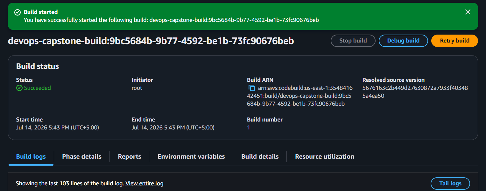

### CodePipeline Created — Source and Build Stages
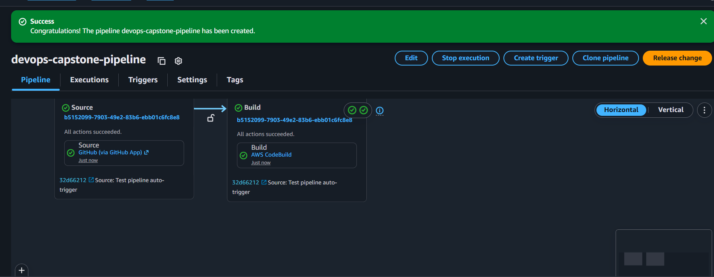

### CodePipeline — Source, Build, and Approval Succeeded
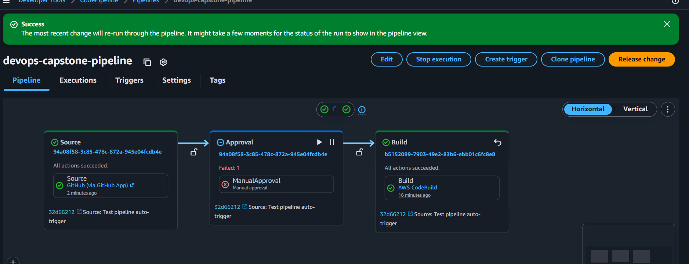

### CloudFormation — Stack Deployment Timeline
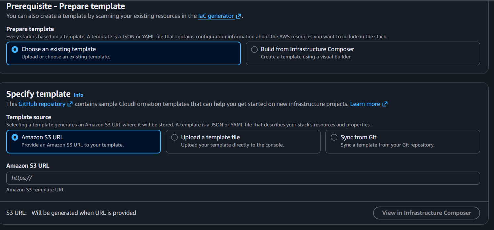

### CloudFormation — Stack CREATE_COMPLETE
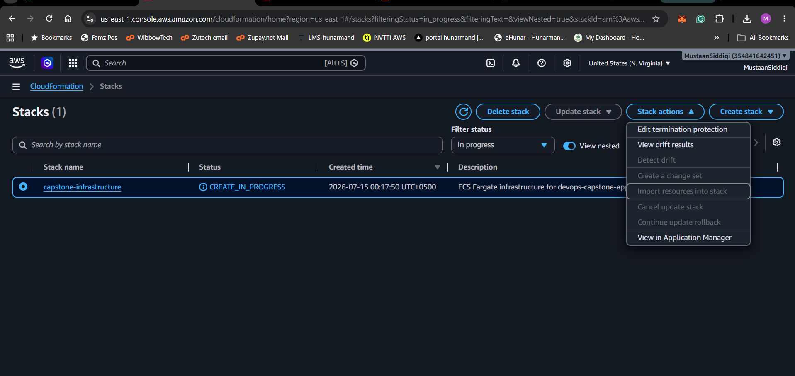

### CodeDeploy — Application Created
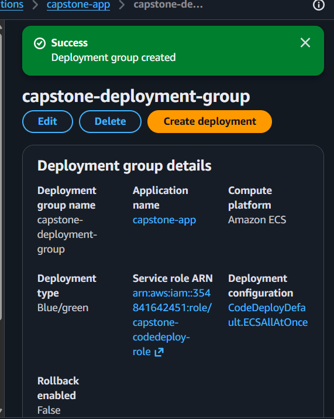

### CodeDeploy — Deployment Group Created (Blue/Green)
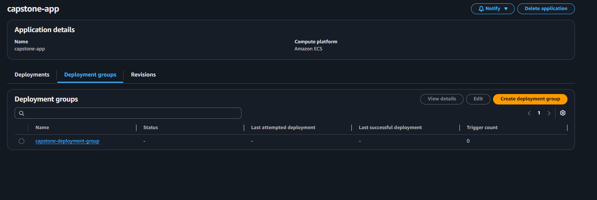

### CodePipeline — Execution History
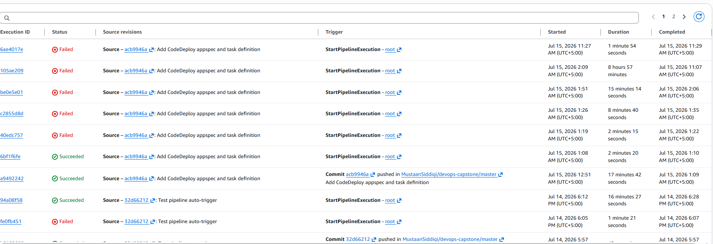

### CodeDeploy — Blue/Green Deployment In Progress
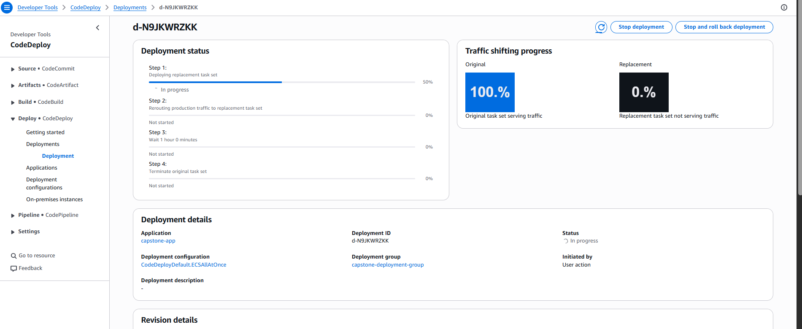

### CodeDeploy — Blue/Green Deployment Succeeded (100% Traffic Shifted)
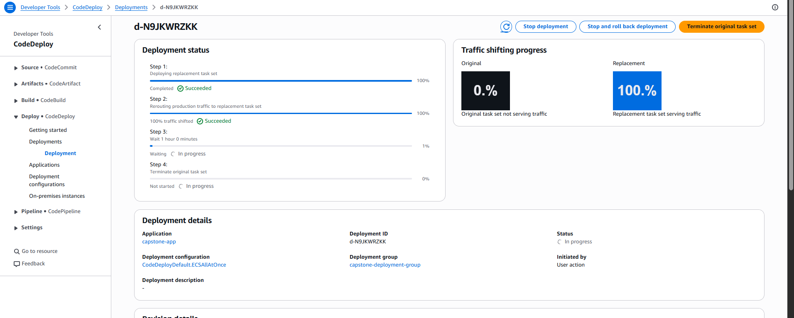

### CloudWatch — Log Group with Live Log Streams
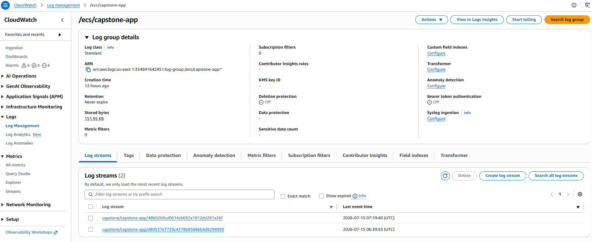

### CloudWatch — Metric Filter Created
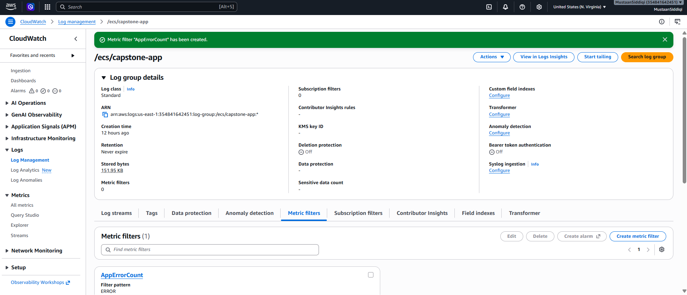

### CloudWatch — Alarm Created
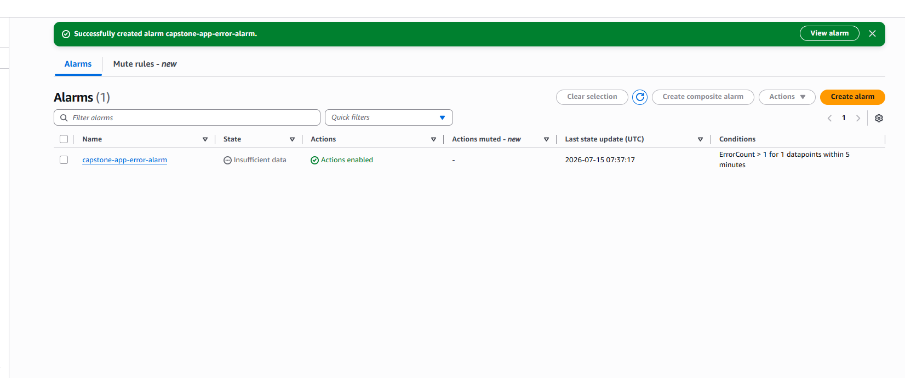

### CloudWatch — Alarm Triggered (In Alarm State)
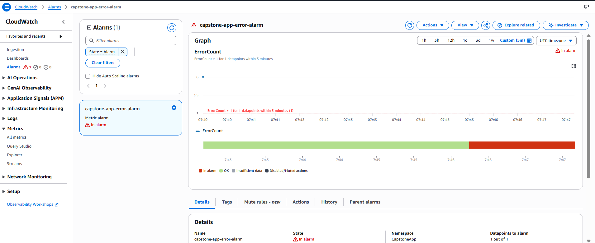

## Known Issues & Future Improvements

* The main issue I faced was with the automatic handoff from AWS CodePipeline to AWS CodeDeploy. The Source, Build, and Manual Approval stages completed successfully, but the Deploy stage failed when CodePipeline tried to pass the deployment artifact to CodeDeploy.
* I investigated the issue from several angles. I reviewed and updated the IAM permissions assigned to the CodePipeline and CodeDeploy service roles, checked access to the pipeline artifact stored in Amazon S3, reviewed the KMS key permissions used to encrypt the artifact, and temporarily applied broader permissions such as `AWSCodeDeployFullAccess` to rule out a missing permission.
* I also checked AWS CloudTrail to look for an `AccessDenied` event or another API-level failure that could explain the issue. However, no clear permission denial was recorded. The required permissions appeared to be available, and there was no CloudTrail-visible error showing that CodePipeline or CodeDeploy had been blocked from accessing the artifact.
* Based on this investigation, the problem did not appear to be a simple IAM, S3, or KMS permission gap. It seemed more likely to be related to the internal artifact handling or configuration requirements of the CodePipeline ECS Blue/Green deployment action.
* To make sure the actual deployment architecture was still working, I triggered the deployment directly from the AWS CodeDeploy console. CodeDeploy successfully created the replacement task set, registered it with the Green target group, verified the application health checks, and shifted 100% of the traffic from the original environment to the replacement environment.
* This successful manual deployment proved that the ECS service, Application Load Balancer, Blue and Green target groups, task definition, AppSpec configuration, health checks, and CodeDeploy deployment group were all functioning correctly. The remaining issue was isolated to the automatic integration between CodePipeline and CodeDeploy rather than the Blue/Green deployment mechanism itself.
* With more time, I would improve the project by making the container image update fully dynamic so that each successful pipeline run builds and deploys a uniquely tagged image instead of relying on a manually updated image reference.
* I would also replace the `ECSAllAtOnce` traffic-shifting configuration with a canary or linear deployment strategy. This would allow a small percentage of production traffic to be sent to the new version first, giving additional time to detect issues before completing the rollout.
* The current application stores tasks in memory, which means the data is lost whenever the container restarts or a new task is deployed. A future version should use a persistent database such as Amazon RDS or DynamoDB.
* I would also tighten the IAM policies. Broad managed policies such as `AWSCodeDeployFullAccess` were useful during troubleshooting, but a production implementation should use custom least-privilege policies that allow only the specific actions and resources required by the pipeline.
* Additional improvements could include more automated tests, separate development and production environments, automatic rollback based on CloudWatch alarms, HTTPS using AWS Certificate Manager, and more detailed monitoring dashboards for application performance and deployment health.
